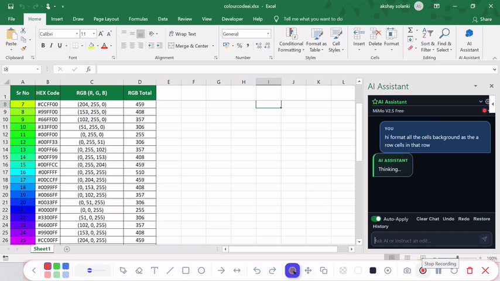

# 🚀 Excel AI Assistant

> **A 100% local, privacy-first AI sidebar for native Microsoft Excel Desktop — powered by OpenCode.**  
> Transform your desktop spreadsheets into an intelligent data canvas with zero subscriptions, zero cloud data leaks, full Undo/Redo, and instant automatic workbook rollback backups.

---

## 🌐 At A Glance

- **Zero Cloud Leakage:** 100% on-device architecture. Spreadsheets and financial records never leave your machine.
- **No $30/mo Subscription:** Free forever under the MIT license — no Microsoft 365 Copilot license required.
- **Native Excel Desktop Integration:** Built with Office.js running directly inside Excel's native taskpane.
- **Bulletproof Safety:** Instant multi-step Undo/Redo plus automatic `.xlsx` pre-execution snapshot backups.
- **Model Freedom:** Connects to OpenCode, giving you access to local LLMs (Ollama, DeepSeek, Llama) or custom endpoints.

---

## ⚖️ Why This Exists: Copilot vs Excel AI Assistant

| Feature | 🔴 Microsoft 365 Copilot | 🟢 Excel AI Assistant (This Project) |
|:---|:---:|:---:|
| **Monthly Cost** | **$30 / user / month** ($360/year) | **$0 / Free & Open Source (MIT)** |
| **Data Privacy** | Cloud transmission to external servers | **100% Local & Private (On-Device)** |
| **Model Choice** | Vendor locked to Microsoft cloud | **Any model supported by OpenCode / Ollama** |
| **Undo / Redo** | Standard Excel undo (often broken by macros) | **Full Transactional Undo & Redo Engine** |
| **Full Rollback** | Manual version history required | **Automatic pre-batch `.xlsx` snapshot backups** |
| **Chart Creation** | Basic charts | **Non-destructive charts with restore persistence** |
| **Works Offline** | No | **Yes (when paired with local LLMs)** |

> 💡 **For Analysts, Businesses & Researchers:** You no longer have to risk uploading confidential company financials, client databases, or proprietary models to public cloud APIs just to get intelligent AI assistance in Excel.

---

## 🎬 Working Proof Demo Video

> 🎥 **Live Browser Playable Demonstration:** Watch Excel AI Assistant dynamically parse instructions, calculate color codes, and batch-format rows live inside Microsoft Excel Desktop.

<div align="center">
  <p><strong>⚡ Real-Time Execution Demo (Auto-playing Preview):</strong></p>
  <a href="assets/demo.mp4">
    
  </a>
  <br><br>
  <p><em>Click the preview above or use the links below to watch the complete 1080p recording with player controls:</em></p>
  <p>
    <a href="assets/demo.mp4"><strong>▶️ Play in GitHub Video Player (assets/demo.mp4)</strong></a> &nbsp;|&nbsp;
    <a href="https://raw.githubusercontent.com/akshayai1996/excel-addin-ai/main/assets/demo.mp4"><strong>🌐 Direct Browser Video Stream</strong></a> &nbsp;|&nbsp;
    <a href="assets/Simpink_Rec_20260920_212837.webm"><strong>📹 WebM Master Recording</strong></a>
  </p>
</div>

---

## 🖥️ How It Works

```
┌────────────────────────────────────────────────────────────────────────┐
│               EXCEL AI ASSISTANT -- RUNTIME ARCHITECTURE               │
├────────────────────────────────────────────────────────────────────────┤
│  Microsoft Excel Desktop (Windows 10 / 11)                             │
│  │                                                                     │
│  ▼ Embedded WebView2 Taskpane                                          │
│  Office.js Frontend  [taskpane.html + taskpane.js + excel_actions.js]  │
│  ├── Transactional In-Memory Undo / Redo Stack                         │
│  ├── Non-Destructive Chart & Graph Lifecycle Manager                   │
│  └── Pre-Batch Full Workbook (.xlsx) Snapshot Engine                   │
│  │                                                                     │
│  ▼ Local HTTPS Request  (https://localhost:3000)                       │
│  Local Python Bridge Server  [server/bridge_server.py]                 │
│  ├── 100% On-Device Traffic -- Zero Cloud Transmission                 │
│  ├── Session-Isolated Chat History & State Sync                        │
│  └── OpenCode CLI Subprocess Bridge & AST Validator                    │
│  │                                                                     │
│  ▼ Local Socket / CLI Process                                          │
│  OpenCode AI Engine  (Local Models / Free Tiers / Custom Endpoints)    │
└────────────────────────────────────────────────────────────────────────┘
```

---

## ⚡ Key Capabilities

### 📊 Natural Language Spreadsheet Operations
- **Formula Generation & Auditing:** Writes standard and advanced Excel formulas (`XLOOKUP`, `INDEX/MATCH`, `SUMIFS`, dynamic arrays) and explains calculation logic.
- **Intelligent Formatting:** Clean header styles, currency formatting, alternating row stripes (zebra striping), percentage normalization, and auto-fitted columns.
- **Conditional Formatting:** Color scales, threshold highlights, negative margin alerts, and top/bottom rules.
- **Data Hygiene:** Deduplication, trimming rogue whitespace, date normalization, and case standardization across thousands of rows.

### 📈 Non-Destructive Chart & Graph Generator
- Generates clustered column charts, bar charts, line graphs, pie charts, and scatter plots directly from your data ranges.
- **Smart Chart Preservation:** Modifying data or running rollbacks will never corrupt or detach existing charts.
- **Chart Restoration:** Reverting changes restores previous chart layouts and data series cleanly.

### 🧠 Flexible Model Control
- **⚡ Quick:** Low-latency mode for rapid formula lookups, formatting, and single-cell edits.
- **⚖️ Standard:** Balanced mode for structured multi-step analysis and report structuring.
- **🧠 Deep:** High-reasoning mode for complex business logic, multi-table consolidation, and forecasting models.

---

## 🛡️ Enterprise-Grade Safety Net

When AI interacts with financial models and large datasets, errors must never corrupt your data. This add-in implements a robust three-tier safety net:

```
┌────────────────────────────────────────────────────────────────────────┐
│                  THREE-TIER SPREADSHEET SAFETY SYSTEM                  │
├────────────────────────────────────────────────────────────────────────┤
│  TIER 1: ACTION VALIDATION & AST INTEGRITY                             │
│  Every AI action payload is parsed and checked before execution.       │
│  Malformed actions, bad formulas, or invalid ranges are rejected.      │
│                                                                        │
│  TIER 2: TRANSACTIONAL UNDO & REDO STACK                               │
│  Full reverse actions are recorded in-memory for every mutation.       │
│  One click reverts cells, formats, or chart modifications instantly.   │
│                                                                        │
│  TIER 3: AUTOMATIC PRE-BATCH WORKBOOK BACKUPS                          │
│  Before any batch of changes touches Excel, a complete .xlsx backup    │
│  is generated. If anything goes wrong, restore your entire file.       │
└────────────────────────────────────────────────────────────────────────┘
```

> 🛡️ **Zero Fear Experimentation:** If an AI generation isn't what you expected, click **Undo** in the sidebar. If you want to revert an entire multi-step conversation, click **Restore** to reload the clean pre-batch snapshot.

---

## 📦 Quickstart Guide

### Prerequisites
- **Windows 10 or 11** with **Microsoft Excel Desktop** (Office 2016, 2019, 2021, or Microsoft 365).
- **Python 3.8+** installed and added to `PATH`.
- **OpenCode CLI** installed (`npm install -g opencode-ai` or your local OpenCode environment).

```
┌────────────────────────────────────────────────────────────────────────┐
│                         ONE-TIME SETUP SUMMARY                         │
├────────────────────────────────────────────────────────────────────────┤
│  1. Run PowerShell as Administrator:  .\setup_desktop.ps1              │
│     --> Generates and trusts the localhost SSL certificate.            │
│  2. Start the local bridge server:    start_server.bat                 │
│     --> Starts https://localhost:3000 in background/terminal.          │
│  3. Open Excel Desktop:               Insert -> My Add-ins             │
│     --> Select 'AI Assistant' and click Add. Ready to use!             │
└────────────────────────────────────────────────────────────────────────┘
```

### Detailed Setup (3 Minutes)

#### Step 1: Trust the Localhost SSL Certificate
Excel Desktop's embedded WebView2 requires a valid HTTPS connection to load the taskpane from `localhost`:
1. Open PowerShell **as Administrator**.
2. Run:
   ```powershell
   cd path\to\excel-addin-ai
   .\setup_desktop.ps1
   ```
   *This automatically generates the certificate and registers it in the Windows Trusted Root Certification Authorities store.*

#### Step 2: Launch the Local Bridge Server
Double-click `start_server.bat` or run from your terminal:
```bash
python server/bridge_server.py
```
The server will start listening at `https://localhost:3000`.

#### Step 3: Sideload the Add-in in Excel
1. Open any workbook in **Excel Desktop**.
2. Navigate to **Insert** → **My Add-ins** (or **Home** → **Add-ins** → **My Add-ins**).
3. Under the **Developer Add-ins** section, select **AI Assistant** and click **Add**.
4. Click the new **AI Assistant** icon in your Home ribbon to open the taskpane!

---

## 💬 Sample Prompts to Try

Try pasting these into the taskpane with your data selected:

- **Sales Analysis:**
  > *"Analyze columns A through F. Calculate total revenue and profit margin per region, then create a clustered column chart comparing Q1 to Q4."*
- **Formatting Cleanup:**
  > *"Format row 1 as a dark navy header with white bold text. Format column D as currency with 2 decimal places, and highlight negative values in soft red."*
- **Dynamic Formulas:**
  > *"Add a formula in column G that looks up the customer discount from the Rates sheet using XLOOKUP and calculates the net invoice total."*
- **Data Deduplication:**
  > *"Find all duplicate email addresses in column B, highlight the duplicate rows in yellow, and provide a summary count in cell J2."*

---

## 📁 Project Structure

```
excel-addin-ai/
├── manifest.xml           # Office Add-in manifest (ribbon button, icons, permissions)
├── package.json           # Add-in metadata and launch script
├── start_server.bat       # 1-click launcher for the Python HTTPS bridge server
├── setup_desktop.ps1      # Automated PowerShell setup for SSL cert trust
├── install_cert.py        # Cross-platform certificate generator
├── register_catalog.py    # Windows developer add-in catalog registry helper
├── DESKTOP_SETUP.md       # Comprehensive offline setup & troubleshooting documentation
├── assets/                # High-res ribbon and taskpane icons (16px, 32px, 64px, 80px)
├── server/
│   ├── bridge_server.py   # HTTPS bridge server, AST safety validator, OpenCode connector
│   ├── cert.pem           # Local development SSL certificate
│   └── key.pem            # Local development private key
├── src/
│   ├── taskpane.html      # Add-in sidebar markup with model selector & safety controls
│   ├── taskpane.css       # Clean responsive dark/light styling
│   ├── taskpane.js        # Chat session controller & bridge communication
│   └── excel_actions.js   # Office.js execution engine, Undo/Redo & backup restoration
└── test-data/             # Pre-built test workbooks for quick validation
```

---

## 🤝 Contributing

Contributions from developers, data analysts, and Excel enthusiasts worldwide are warmly welcomed!
- **Bug Reports & Ideas:** Open an issue on GitHub.
- **Pull Requests:** Fork the repo, create a feature branch, test thoroughly with Excel Desktop, and submit a PR.
- **Model Support:** Help expand integrations for additional local model runtimes.

---

## 📄 License

This project is licensed under the **MIT License** — see the [LICENSE](LICENSE) file for details.  
Built for the global open-source community by **Akshay Jatin Solanki**.
